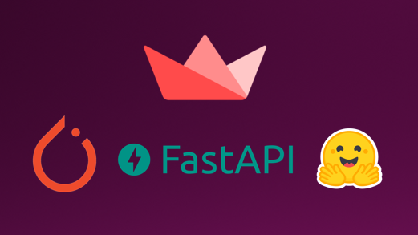

<h1 align="center">Project Insight</h1>

<h2 align="center">NLP as a Service</h2>

<h2 align="center">

</h2>
<p align="center">
<a href="https://github.com/abhimishra91/insightissues"></a>
<a href="https://github.com/abhimishra91/insight/network"></a>
<a href="https://github.com/abhimishra91/insight/stargazers"></a>
<a href="https://github.com/abhimishra91/insight/blob/master/LICENSE"></a>
<a href="https://github.com/abhimishra91/insight/blob/master/LICENSE"></a>
<a href="https://github.com/abhimishra91/insight/"></a>
</p>

## Introduction

Project Insight is designed to create NLP as a service with code base for both front end GUI (**`streamlit`**)  and backend server (**`FastApi`**) the usage of transformers models on various downstream NLP task.

The downstream NLP tasks covered:

* News Classification

* Entity Recognition

* Sentiment Analysis

* Summarization

* Information Extraction `To Do`

The user can select different models from the drop down to run the inference.

The users can also directly use the backend fastapi server to have a command line inference. 

### Features of the solution

* **Python Code Base**: Built using `Fastapi` and `Streamlit` making the complete code base in Python.
* **Expandable**: The backend is desinged in a way that it can be expanded with more Transformer based models and it will be available in the front end app automatically. 

## Installation

* Clone the Repo.
* Run the `Docker file` to create the Docker images.
* Run the `Docker images` to start the front end and back end. service

## Project Details

### Directory Details

* **Front End**: Front end code is in the `src_streamlit` folder. Along with the `Dockerfile` and `requirements.txt`

* **Back End**: Back End code is in the `src_fastapi` folder.
    * This folder contains script for each task: `classificationpro.py`, `nerpro.py`, `sentimentpro.py`...
    * `app_fastapi.py` is the main application file that calls each servie based on the api call made by the front end.
    * Each NLP task has its own folder and within each folder each trained model has 1 folder each. For example:
    ```
    - sentiment
        - distilbert
            - model.bin
            - network.py
            - tokeniser files
        -roberta
            - model.bin
            - network.py
            - tokeniser files
    ```
    * For each new model under each service a new folder will have to be added.
    * Each folder model will need the following files:
        * Model bin file.
        * Tokenizer files
        * `network.py` Defining the class of the model if customised model used.

    * `config.json`: This file contains the details of the models in the backend and the dataset they are trained on.

### How to Add a new Model

1. Fine Tune a transformer model for specific task. You can leverage the [transformers-tutorials](https://github.com/abhimishra91/transformers-tutorials)

2. Savve the model files, tokenizer files and also create a network.py script if using a customized training network.

3. Create a directory within the NLP task with `directory_name` as the `model name` and save all the files in this directory.

4. Update the `config.json` with the model details and dataset details.

5. Update the `<service>pro.py` with the correct imports and conditions where the model is imported. For example for a new Bert model in Classification Task, do the following:
    * Create a new directory in `classification`. Directory name `bert`.
    * Update `config.json` with following:
        ```
        "classification": {
        "model-1": {
            "name": "DistilBERT",
            "info": "This model is trained on News Aggregator Dataset from UC Irvin Machine Learning Repository. The news headlines are classified into 4 categories: **Business**, **Science and Technology**, **Entertainment**, **Health**. [New Dataset](https://archive.ics.uci.edu/ml/datasets/News+Aggregator)"
        },
        "model-2": {
            "name": "BERT",
            "info": "Model Info"
        }
        }
        ```
    * Update `classificationpro.py` with the following snippets:
        
        **_Only if customized class used_**
        ```
        from classification.bert import BertClass
        ```

        **_Section where the model is selected_**
        ```
        if model == "bert":
            self.model = BertClass()
            self.tokenizer = BertTokenizerFast.from_pretrained(self.path)
        ```

## Technology Used

## License

